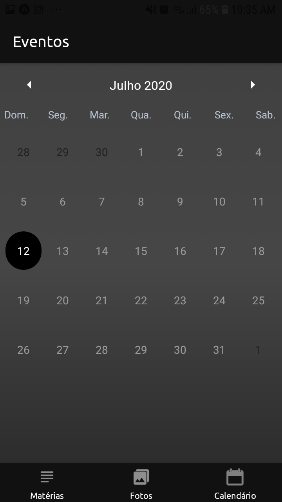

# College-Planner-
<h3>Technologies</h3>

This project was developed with the following technologies:

- [Expo](https://expo.io/)
- [React-Native](https://facebook.github.io/react-native/)
- [React Navigation](https://reactnavigation.org/)
- [expo-linear-gradient](https://docs.expo.io/versions/latest/sdk/linear-gradient/)
 - [expo-sqlite](https://docs.expo.io/versions/latest/sdk/sqlite/)
  - [redux](https://redux.js.org/)
  - [redux-thunk](https://github.com/reduxjs/redux-thunk)
  - [expo-file-system](https://docs.expo.io/versions/latest/sdk/filesystem/)
  - [react-native-elements](https://react-native-elements.github.io/react-native-elements/docs/getting_started.html)
 
<h3>How To Use</h3>

To clone and run this application, you'll need [Git](https://git-scm.com), [Node.js v10.16][nodejs] or higher + [Yarn v1.13][yarn] or higher + [Expo CLI][expo] installed on your computer. From your command line:

```bash
# Clone this repository
$ git clone https://github.com/joaovitor32/College-Planner

# Go into the repository
$ cd College-Planner

# Install dependencies
$ npm install

# Run the app
$ expo start

```
<p align="center">

  
  
   
</p>
<p align="center">

  
  
   
</p>
<p align="center">
  
</p>
